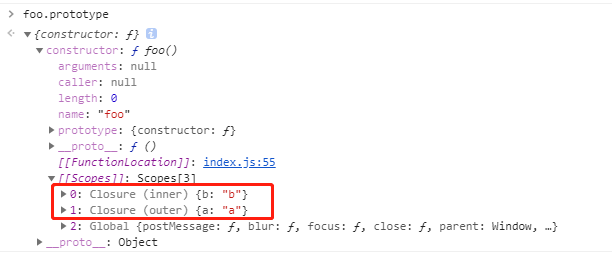

## 作用域

### 全局作用域/函数作用域/块级作用域

1.标识有效范围

首先看一段代码：

```js
var out = 'a';
function foo() {
  var inner = 'b';
  console.log(out + inner);
}
foo(); // ab
console.log(out); // a
console.log(inner); // 报错：inner is not defined
```

在全局中定义的**out**在函数内外都可以打印，而foo函数内变量只有在函数中才可访问，函数外访问会报错。
上面的代码中，
全局作用域的标识有：out(变量)，foo(函数声明)；
局部作用域（函数作用域）的标识有：inner(变量)；
当访问变量时，内层作用域先会在其局部作用域中查找该变量，若是找不到，则会往上一级找，本例子中，foo函数要访问out变量，先会在foo函数中查找，找不到后，往上一级（全局作用域）查找；而在全局访问inner变量时，在全局作用域中找不到该变量，（全局已经是最外层的作用域），则会直接报错。

块级作用域通过let或const来进行声明，作用范围是一个函数内部，或者一个代码块（花括号内，比如switch，for，if...）内部

```js
for(let i = 0; i < 4; i += 1) {
  console.log(i); // 0 1 2 3
}
console.log(i); // 报错：i is not defined

for(var i = 0; i < 4; i += 1) {
  console.log(i); // 0 1 2 3
}
console.log(i); // 4
```

上面例子中，使用let声明i，在for循环内部可以访问i，但是外部不可以。而如果是使用var声明，那么i是一个全局作用域的变量，在for循环外同样可以获取。

2.变量声明

```js
function bar() {
  console.log(b); // undefined
  var b = 1;
}
bar();
```

在上面bar函数中，访问b变量在声明赋值b变量的语句之前，但是console.log语句并不会报错，只是打印出undefined。这是因为变量提升。当函数开始执行前，作用域中的变量声明会提升到函数最顶部，所以这个时候访问b，只是访问了一个声明但未赋值的变量，效果类似于下面：

```js
function bar() {
  var b;
  console.log(b); // undefined
  b = 1;
}
bar();
```

再看一个例子：

```js
var a = 10;
function test() {
  console.log(a); // undefined
  var a = 20; // 由于变量提升，当前作用域已经有自己的a，第一次console.log为undefined
  console.log(a); // 20
}
test();
```

但是let声明的变量不会提升，直到它们的定义被执行时才初始化,所以在声明语句前就访问是会报错的：

```js
function bar() {
  console.log(b); // 报错：Cannot access 'b' before initialization
  let b = 1;
}
bar();
```

变量b从块顶部到初始化处理的处于“暂存死区”中

### 词法作用域/动态作用域

词法作用域在词法分析阶段确定，不会改变，依据的是变量和函数的声明位置，也叫静态作用域；动态作用域在执行阶段确定，依据的是函数的调用关系。

```js
var a = 'a';
function foo() {
  console.log(a);
}
function bar() {
  var a = 'b';
  foo();
}
bar();
```

当执行foo函数时，需要访问a，现在foo中查找a，找不到，到上一级作用域中查找，那么上一级是指哪一级？
如果按词法作用域，上面的执行结果是打印'a'：
现在各作用域的标识如下：
全局作用域：a,foo,bar
foo局部作用域：
bar局部作用域：a
因为是词法作用域，依据的是变量和函数的声明位置。foo是在全局中声明的，所以上一级是全局作用域，全局变量a的值为'a'，故打印'a'。

如果按动态作用域，上面的执行结果是打印'b'：
因为是动态作用域，依据的是变量和函数的调用关系。foo是在bar函数中被调用的，所以上一级是bar，在bar局部作用域中查找a变量，找到其局部变量a值为'b'，故打印'b'。
// 函数调用重建词法作用域，循环不重建词法作用域

## 作用域链

作用域链是可访问变量，对象，函数的集合。

```js
var a = 'a'
function foo() {
  var b = 'b';
  function bar() {
    var c = 'c';
  }
  bar();
}
foo();
```

执行bar函数时作用域如下：


作用域链中保存着在各级作用域中的可访问变量/函数，当前执行函数在作用域链的顶部，全局作用域在作用域链的底部。执行函数过程中，访问变量会沿着作用域链寻找。

## 执行期上下文

执行期上下文分两个阶段：

1. 创建阶段：生成变量对象，建立作用域链，确定上下文（this）
2. 执行阶段：顺序执行代码
当执行上下文的生命周期结束，该执行上下文会被销毁，下次再执行该函数时会重新创建一个新的。（例外：闭包会阻止这个销毁）

特别的，this永远指向调用它的对象：

```js
var foo = {
  bar: function() {
    console.log(this);
  }
}
foo.bar(); // {bar: f}.this指向foo
var f = foo.bar;
f(); // Window.this指向window对象
```

## 闭包

```js
function outer() {
  var a = 'a';
  function inner() {
    var b = 'b';
    return function foo() {
      console.log(a + b);
    }
  }
  return inner();
}
var foo = outer();
foo(); // 'ab'
```

变量的生命周期在它声明时初始化，局部变量在函数执行完毕后销毁，全局变量在页面关闭后销毁。所以按理说上面foo函数访问a和b应该都是访问不到的，但是这里我们看到都可以正常打印出来，而这是闭包的作用。

闭包是由函数以及创建该函数的词法环境组合而成，这个环境包含了这个闭包创建时所能访问的所有局部变量。
打印foo.prototype可以看到：


