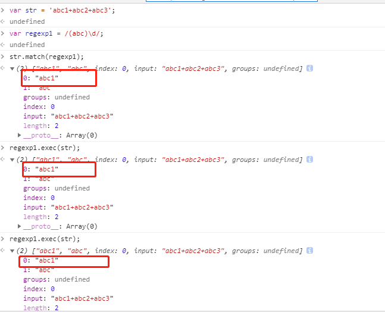
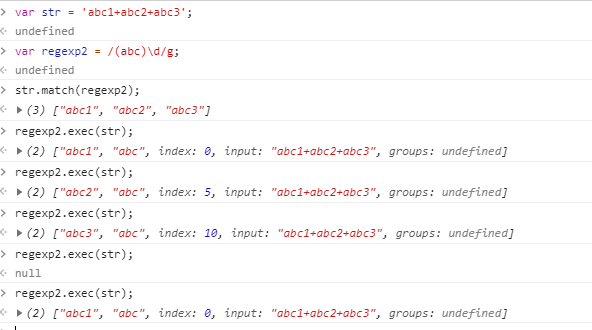

exec 是一个 RegExp 方法，意思是它的执行是：regexp.exec(str);
match 是一个 String 方法，意思是它的执行是：str.match(regexp);

当不使用全局匹配时，两者可以得到相同的结果：

```js
var str = "abc1+abc2+abc3";
var regexp1 = /(abc)\d/;

str.match(regexp1); // (2)["abc1", "abc", index: 0, input: "abc1+abc2+abc3", groups: undefined...]
regexp1.exec(str); // (2)["abc1", "abc", index: 0, input: "abc1+abc2+abc3", groups: undefined...]
```

因为非全局匹配，它们得到了完全一样的结果“abc1”：



当使用全局匹配时，两者的行为表现就不一致了：

```js
var str = "abc1+abc2+abc3";
var regexp2 = /(abc)\d/g;

str.match(regexp2); // (3) ["abc1", "abc2", "abc3"]
regexp2.exec(str); // (2) ["abc1", "abc", index: 0, input: "abc1+abc2+abc3", groups: undefined...]
regexp2.exec(str); // (2) ["abc2", "abc", index: 5, input: "abc1+abc2+abc3", groups: undefined...]
regexp2.exec(str); // (2) ["abc3", "abc", index: 10, input: "abc1+abc2+abc3", groups: undefined...]
regexp2.exec(str); // null
regexp2.exec(str); // (2) ["abc1", "abc", index: 0, input: "abc1+abc2+abc3", groups: undefined...]
```

使用全局匹配时，match 方法会得到所有匹配项，并作为一个数组返回；
而 exec 方法每次只得到一个，每一次执行 exec 再接着往下找,直到找不到返回 null，之后再执行则再次从头匹配


